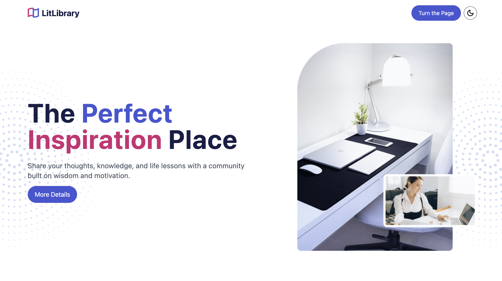

# LitLibrary 📚✨  

LitLibrary (Literature Library) is a vibrant blogging platform designed to foster a positive and supportive community. Users can share personal growth experiences, life knowledge, advice, and insights while engaging with others' blogs. It’s a place to inspire, learn, and connect.  

For instance, newbies and beginners from any career field can share their newly acquired knowledge by explaining concepts to others. This not only helps them solidify their understanding but also invites discussions, feedback, and suggestions from other users. The community can point out what works well, highlight any gaps, and offer advice to improve or expand on the shared knowledge. So, join the conversation and start growing together with LitLibrary! 🚀  



## 📑 Table of Contents
- [Features](#🌟-features)
  - [Blogging Features](#blogging-features)
  - [User Experience](#user-experience)
  - [Upcoming Features](#upcoming-features)
- [Tech Stack](#🛠️-tech-stack)
  - [Frontend](#frontend)
  - [Backend](#backend)
  - [Deployment](#deployment)
  - [Code Optimization](#code-optimization)
- [How to Get Started](#🚀-how-to-get-started)
- [Inspiration](#💡-inspiration)
- [Contributing](#🧑‍💻-contributing)
- [Live Demo](#🌐-live-demo)
- [License](#license)

## 🌟 Features  

### Blogging Features  
- **Post Blogs**: Share blogs about personal growth, life experiences, advice, or knowledge sharing.  
- **Edit & Delete**: Manage your own blogs seamlessly.  
- **Comments**: Leave comments, advice, or feedback on blogs to connect with others.  
- **Like & Save Blogs**: Like blogs you enjoy and save them for later reading.  

### User Experience  
- **Elegant UI**: Aesthetic design with dark and light mode options for user comfort.  
- **Search & Filter**: Search for blogs by title or filter by categories for focused exploration.  
- **Up-to-Top Button**: Navigate smoothly with a scroll-to-top button.  
- **Profile Management**:  
  - View your own blogs.  
  - Access blogs you've liked and saved for later reading.  
  - Filter by uploaded blogs, liked blogs, and read-later lists.  

### Upcoming Features  
- **Infinite Scroll**: Effortless browsing with infinite scrolling in the "All Blogs" page.  (Implemented ✅ – however, this feature is disabled in the app as it interferes with the search functionality. You can still check it out in src/pages/Test.jsx.)
- **Notifications**: Receive a notification alert whenever someone likes or comments on your blog. (Manually implemented ✅ – not using Firebase Notifications.)
- **Feed Back System**: Allow users to share their feedback and experiences with LitLibrary.

## 🛠️ Tech Stack  

### Frontend  
- **React**: Component-based frontend library for building dynamic UI.  
- **Vite**: Fast and modern development environment for React.  
- **Tailwind CSS**: Utility-first CSS framework for responsive design.  
- **React-Router**: Seamless navigation across pages.  
- **React-Transition-Group**: Smooth page transitions.  
- **React-Spinner**: Custom loading indicators.  
- **Moment.js**: Human-readable date and time formatting.  
- **React-Linkify**: Effortless hyperlinking of URLs in text.  

### Backend  
- **Firebase**: Scalable backend infrastructure:  
  - **Firestore Database**: Real-time storage of blogs, users, and comments.  
  - **Firestore Storage**: Image storage for blog posts.  
  - **Authentication**: Secure login via email/password and Google Sign-In.  

### Deployment  
- **Vercel**: Reliable and fast hosting for seamless user access.  

### Code Optimization  
- **Custom Hooks**: Modular and reusable hooks for efficient code management.  
- **Reusable Components**: Clean, DRY (Don’t Repeat Yourself) code principles.  
- **Context API**: Global state management across the app.  

## 🚀 How to Get Started  

1. **Clone the Repository**:
  
   ```bash  
   git clone https://github.com/yourusername/litlibrary.git  
3. **Install Dependencies**:
   ```bash  
   npm install
4. **Set Up Firebase**:  
   - Create a Firebase project.
   - Enable Firestore Database, Storage, and Authentication.
   - Configure the Firebase settings in your project.
5. **Run the App Locally with Vite**:  
   ```bash  
   npm run dev  
6. **Build for Production**:  
   ```bash  
   npm run build
## 💡 Inspiration

LitLibrary (Literature Library) was inspired by the need for a positive, supportive platform where users can freely share experiences and knowledge while learning from others. It’s designed to create connections and foster personal and collective growth.

## 🧑‍💻 Contributing
Contributions are welcome! Follow these steps to contribute:
1. Fork the repository.
2. Create a new branch for your feature:
   
   ```bash
   git checkout -b feature-name
4. Commit your changes:
   ```bash
   git commit -m "Add feature-name"
5. Push to your branch:
   ```bash
   git push origin feature-name
6. Create a pull request.

## 🌐 Live Demo
Check out the live version of LitLibrary: https://lit-library-iota.vercel.app

## License
This project is licensed under the [MIT License](LICENSE.md).

---
Crafted with 💖 by Fisheeesh
```bash
Let me know if you need additional refinements! 😊
```
📧 Contact: [swanphyo444@gmail.com](mailto:swanphyo444@gmail.com)
